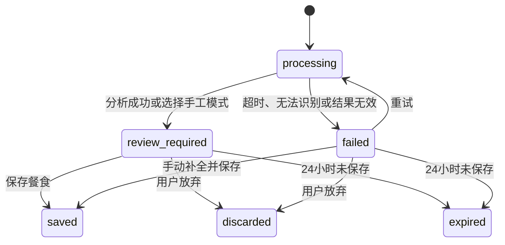
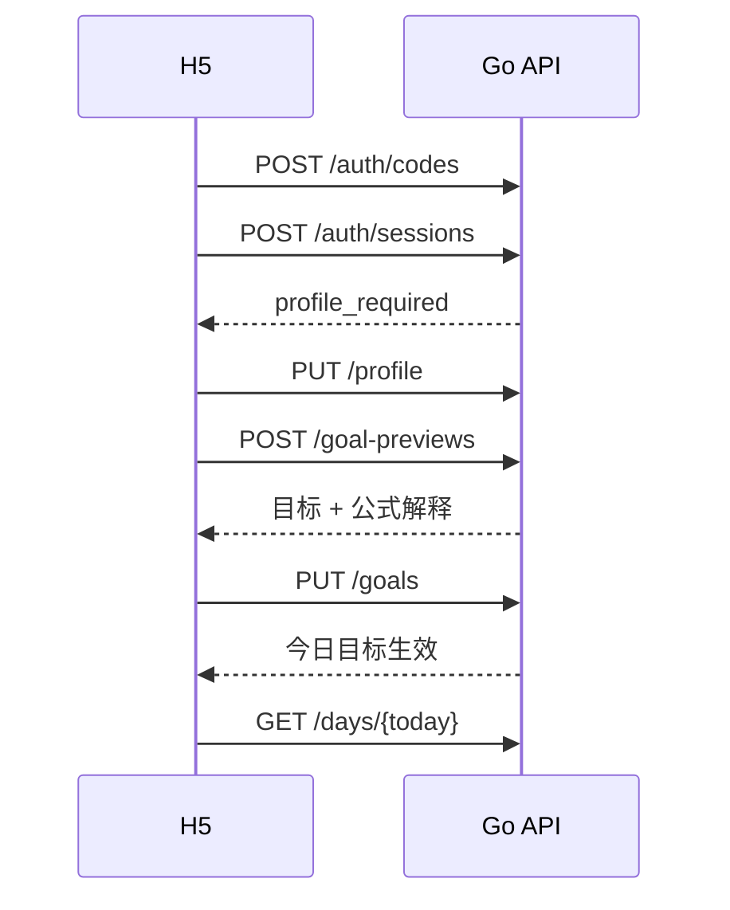
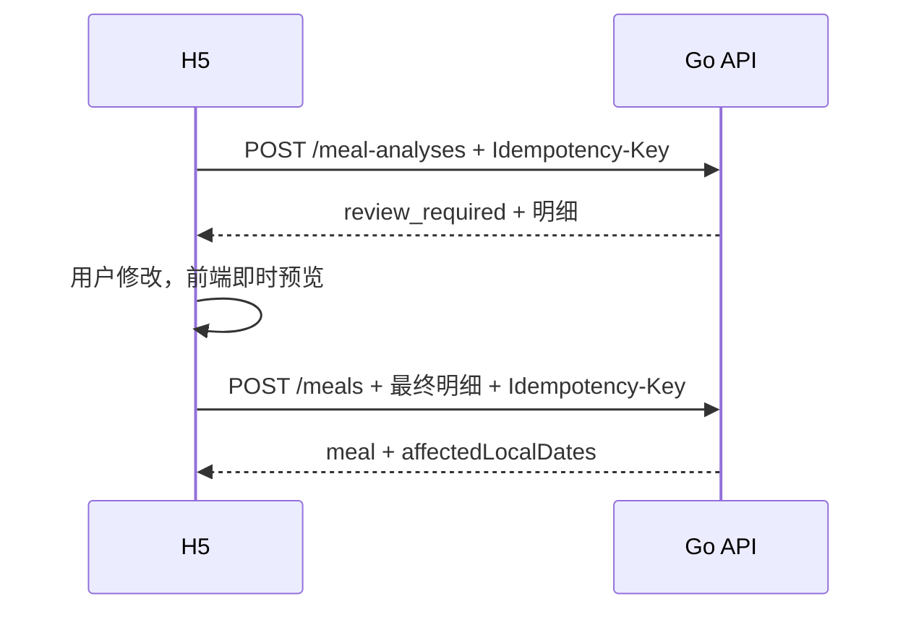
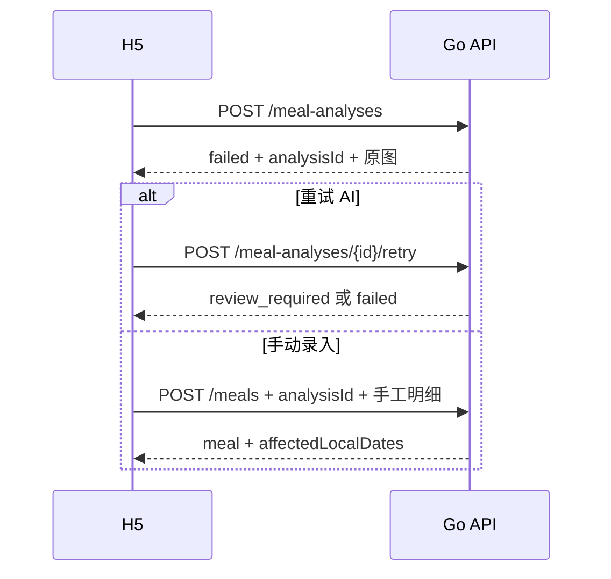

# FormTally V1 API 契约

> 状态：待产品与技术确认<br>
> 版本：V1.0<br>
> 日期：2026-09-10<br>
> 基础路径：`/v1`<br>
> 本文定义客户端与服务端之间的接口契约，不包含 Go 或前端业务实现。

## 1. 文档关系

本文以以下文档为输入：

- [一期功能规格与验收标准](./spec-v1.md)
- [一期使用流程](./user-flow-v1.md)
- [一期技术架构](./architecture-v1.md)

本文确认后，将取代技术架构文档中的高层接口清单，成为 V1 接口行为依据。接口变更必须同步修改本文和对应验收映射。

## 2. 设计原则

- REST JSON API，只有图片上传使用 `multipart/form-data`。
- H5 使用安全 Cookie 登录，不把会话令牌暴露给 JavaScript。
- Go 后端是目标计算、日期归属、营养汇总和进度状态的唯一事实来源。
- AI 分析草稿与正式饮食记录分离；草稿永远不直接计入每日汇总。
- 创建分析和保存餐食必须幂等，网络重试不能产生重复数据。
- 客户端只提交用户输入，不提交可由服务端唯一推导的整餐汇总和进度状态。
- 所有资源都按当前登录用户隔离；无权访问的资源统一表现为不存在。
- 一期只设计已确认能力，不为训练、支付、社交或食品数据库预留空接口。

## 3. 通用协议

### 3.1 请求与响应

- 生产环境只允许 HTTPS。
- JSON 请求使用 `Content-Type: application/json; charset=utf-8`。
- JSON 响应使用 `Content-Type: application/json; charset=utf-8`。
- 私有响应使用 `Cache-Control: no-store`。
- 成功响应直接返回具名资源，不再套统一的 `data` 层。
- 无响应体的成功操作返回 `204 No Content`。
- 客户端请求应携带 `Accept-Language: zh-CN`；一期错误文案只保证简体中文。

### 3.2 命名和基本类型

| 类型 | 约定 | 示例 |
| --- | --- | --- |
| JSON 字段 | `camelCase` | `localDate` |
| 资源 ID | 不透明字符串，客户端不得解析 | `meal_01K...` |
| 时间点 | RFC 3339，必须带时区偏移 | `2026-09-10T12:30:00+08:00` |
| 本地日期 | `YYYY-MM-DD` | `2026-09-10` |
| 月份 | `YYYY-MM` | `2026-09` |
| 时区 | IANA 时区名称 | `Asia/Shanghai` |
| 手机号 | E.164 | `+8613812345678` |
| 热量 | 整数千卡 | `610` |
| 重量和营养素 | JSON number，最多一位小数 | `37.2` |
| 比例 | 小数，`1` 表示 100% | `0.92` |

请求中省略字段表示“不修改”；显式 `null` 只在字段定义允许时有效。服务端不得把缺失字段和零值混为一谈。

### 3.3 请求标识

- 服务端为每个请求生成 `X-Request-ID` 并通过同名响应头返回。
- 客户端可以发送自己的合法 `X-Request-ID`；服务端可接受或替换。
- 错误响应中的 `requestId` 必须与响应头一致。

### 3.4 幂等键

以下接口必须携带 `Idempotency-Key`：

- `POST /v1/meal-analyses`
- `POST /v1/meal-analyses/{analysisId}/retry`
- `POST /v1/meals`

规则：

- 值由客户端生成，同一用户范围内唯一，长度 16 至 128 个 ASCII 字符。
- 同一键和相同请求内容在 24 小时内返回第一次操作的结果，不重复执行。
- 同一键配合不同请求内容返回 `409 IDEMPOTENCY_CONFLICT`。
- 服务端处理状态不明确时返回 `409 OPERATION_IN_PROGRESS`，客户端按 `Retry-After` 重试。

### 3.5 并发修改

可编辑资源返回从 1 开始递增的 `revision`。修改请求必须提交当前 `expectedRevision`：

- 匹配时执行修改并递增版本。
- 不匹配时返回 `409 REVISION_CONFLICT` 和当前资源摘要。
- 客户端必须提示数据已变化并重新载入，不能静默覆盖。

### 3.6 认证和跨站保护

- H5 登录成功后由服务端设置 `HttpOnly; Secure; SameSite=Lax` Cookie。
- H5 请求必须携带 Cookie；前端不读取会话令牌。
- 所有会改变数据的 Cookie 请求都校验 `Origin` 是否在允许列表。
- 未登录或会话失效返回 `401 UNAUTHENTICATED`。
- 用户访问其他用户资源时返回 `404 RESOURCE_NOT_FOUND`，不暴露资源存在性。
- 后续小程序和 App 的令牌方式不属于 V1 契约。

### 3.7 限流

发生限流时返回 `429 RATE_LIMITED`，并返回 `Retry-After` 秒数。验证码、登录验证和 AI 分析分别限流，具体阈值属于部署配置，不写死在客户端。

## 4. 通用数据结构

### 4.1 营养值 `Nutrition`

```json
{
  "energyKcal": 610,
  "proteinGrams": 48.0,
  "carbGrams": 63.0,
  "fatGrams": 18.0
}
```

约束：

- 热量为 0 至 20000 的整数。
- 每项营养素为 0 至 5000，最多一位小数。
- 单个食物和整餐都使用相同结构。

### 4.2 营养目标 `NutritionTarget`

```json
{
  "energyKcal": 2200,
  "proteinGrams": 138,
  "carbGrams": 275,
  "fatGrams": 61
}
```

目标约束：热量为 1 至 10000；各营养素为 1 至 2000。

### 4.3 图片引用 `PrivateImage`

```json
{
  "url": "https://objects.example.com/signed/...",
  "expiresAt": "2026-09-10T12:40:00+08:00",
  "width": 1200,
  "height": 900,
  "mimeType": "image/jpeg"
}
```

- `url` 是短时效签名地址，不是永久公开地址。
- 客户端不得持久保存签名地址，需要展示时重新获取资源。
- 没有图片时字段值为 `null`。

### 4.4 进度 `MetricProgress`

```json
{
  "consumed": 1660,
  "target": 2200,
  "ratio": 0.7545,
  "band": "below",
  "balance": {
    "type": "remaining",
    "amount": 540
  }
}
```

枚举：

- `band`: `below`、`near`、`above`，分别对应小于 90%、90% 至 110%、大于 110%。
- `balance.type`: `remaining` 或 `exceeded`。

目标、比例、状态和余额全部由服务端计算；前端只负责展示。

### 4.5 食物明细 `MealItem`

```json
{
  "id": "item_01K...",
  "draftItemId": "draft_item_01K...",
  "name": "鸡胸肉",
  "grams": 120.0,
  "nutrition": {
    "energyKcal": 198,
    "proteinGrams": 37.2,
    "carbGrams": 0.0,
    "fatGrams": 4.3
  },
  "basisPer100Grams": {
    "energyKcal": 165,
    "proteinGrams": 31.0,
    "carbGrams": 0.0,
    "fatGrams": 3.6
  },
  "origin": "ai_modified",
  "confidence": "medium",
  "assumption": "按熟制去皮鸡胸肉估算"
}
```

约定：

- `name` 去除首尾空白后长度为 1 至 60 个字符。
- `grams` 为 0.1 至 10000，最多一位小数。
- `origin`: `ai`、`ai_modified` 或 `manual`。
- `confidence`: `high`、`medium`、`low`；手工项目为 `null`。
- `assumption` 最长 200 字；没有时为 `null`。
- `draftItemId` 只用于追踪 AI 原始项目，纯手工项目为 `null`。
- `id` 是正式食物明细 ID；分析草稿中的项目为 `null`，保存后由服务端生成。
- `basisPer100Grams` 由服务端根据最终确认值生成，用于客户端即时预览重量缩放；保存时服务端仍会重新验证和汇总。

## 5. 统一错误格式

```json
{
  "error": {
    "code": "VALIDATION_FAILED",
    "message": "部分内容需要修改",
    "requestId": "req_01K...",
    "details": [
      {
        "field": "items[0].grams",
        "reason": "必须在 0.1 至 10000 之间"
      }
    ]
  }
}
```

`message` 用于直接展示；客户端流程判断只使用稳定的 `code`，不能匹配文案。

### 5.1 HTTP 状态与错误码

| HTTP | 错误码 | 含义 |
| --- | --- | --- |
| 400 | `INVALID_REQUEST` | JSON、查询参数、日期或 multipart 结构无效 |
| 401 | `UNAUTHENTICATED` | 未登录、会话过期或已撤销 |
| 404 | `RESOURCE_NOT_FOUND` | 资源不存在或不属于当前用户 |
| 409 | `IDEMPOTENCY_CONFLICT` | 同一幂等键对应不同请求 |
| 409 | `OPERATION_IN_PROGRESS` | 相同幂等操作仍在进行 |
| 409 | `REVISION_CONFLICT` | 编辑基于旧版本 |
| 409 | `ANALYSIS_STATE_CONFLICT` | 当前草稿状态不允许该操作 |
| 409 | `AGREEMENT_VERSION_OUTDATED` | 客户端提交的协议版本不是当前版本 |
| 410 | `VERIFICATION_CODE_EXPIRED` | 验证码已过期，需要重新发送 |
| 410 | `ANALYSIS_EXPIRED` | 分析草稿已过期 |
| 413 | `IMAGE_TOO_LARGE` | 图片体积超过 10 MB |
| 413 | `IMAGE_DIMENSIONS_TOO_LARGE` | 解码后的像素数超过 4000 万 |
| 415 | `IMAGE_UNSUPPORTED` | 不是 JPEG、PNG 或 WebP |
| 422 | `VALIDATION_FAILED` | 字段违反业务范围 |
| 422 | `PHONE_UNSUPPORTED` | 手机号格式或地区不在一期支持范围 |
| 422 | `VERIFICATION_CODE_INVALID` | 验证码错误 |
| 422 | `FUTURE_OCCURRED_AT` | 餐食时间位于未来 |
| 422 | `AUTO_GOAL_NOT_ELIGIBLE` | 当前资料不允许自动计算 |
| 422 | `AI_CONSENT_REQUIRED` | 缺少当前版本的 AI 图片处理确认 |
| 429 | `RATE_LIMITED` | 请求过于频繁 |
| 500 | `INTERNAL_ERROR` | 未分类服务端错误 |
| 503 | `DEPENDENCY_UNAVAILABLE` | 短信、数据库或对象存储暂不可用，且无法形成可恢复资源 |

图片已保存但 AI 无法识别、超时或输出无效时，不返回通用 5xx；服务端返回一个状态为 `failed` 的分析资源，使用户能够使用同一图片重试或手动录入。

## 6. 接口总览

| 方法 | 路径 | 用途 |
| --- | --- | --- |
| POST | `/v1/auth/codes` | 请求登录或删号验证码 |
| POST | `/v1/auth/sessions` | 验证并登录 |
| GET | `/v1/auth/session` | 获取当前会话和启动状态 |
| DELETE | `/v1/auth/session` | 退出当前会话 |
| GET | `/v1/profile` | 获取身体资料 |
| PUT | `/v1/profile` | 保存完整身体资料 |
| GET | `/v1/goals` | 获取目标设置及生效状态 |
| POST | `/v1/goal-previews` | 预览自动或手动目标 |
| PUT | `/v1/goals` | 保存完整目标设置 |
| POST | `/v1/meal-analyses` | 上传图片并创建 AI 或手工草稿 |
| GET | `/v1/meal-analyses/{analysisId}` | 获取草稿状态与结果 |
| POST | `/v1/meal-analyses/{analysisId}/retry` | 使用原图重新分析 |
| DELETE | `/v1/meal-analyses/{analysisId}` | 放弃未保存草稿 |
| POST | `/v1/meals` | 确认并保存一餐 |
| GET | `/v1/meals/{mealId}` | 获取记录详情 |
| PATCH | `/v1/meals/{mealId}` | 修改日期、餐别或全部明细 |
| DELETE | `/v1/meals/{mealId}/image` | 只移除图片 |
| DELETE | `/v1/meals/{mealId}` | 删除整餐 |
| GET | `/v1/days/{localDate}` | 获取某日目标、汇总和餐次 |
| GET | `/v1/history?month={YYYY-MM}` | 获取月历摘要 |
| POST | `/v1/account-deletions` | 验证并删除账户 |

共 21 个接口，不包含后台管理或未来训练接口。

## 7. 登录与会话

### 7.1 请求验证码

`POST /v1/auth/codes`

```json
{
  "phone": "+8613812345678",
  "purpose": "login"
}
```

`purpose` 为 `login` 或 `delete_account`。删除账户验证码要求当前会话已登录，且手机号必须属于当前用户。

成功返回 `202 Accepted`：

```json
{
  "verification": {
    "requestId": "verify_01K...",
    "expiresInSeconds": 300,
    "retryAfterSeconds": 60
  }
}
```

为减少手机号探测风险，登录场景无论手机号是否已注册都返回相同结构。

### 7.2 创建会话

`POST /v1/auth/sessions`

```json
{
  "phone": "+8613812345678",
  "code": "123456",
  "verificationRequestId": "verify_01K...",
  "agreements": {
    "termsVersion": "2026-09-10",
    "privacyVersion": "2026-09-10"
  }
}
```

成功返回 `201 Created` 并设置 Cookie：

```json
{
  "session": {
    "expiresAt": "2026-10-10T10:00:00+08:00"
  },
  "user": {
    "id": "user_01K...",
    "phoneMasked": "+86 138****5678",
    "onboardingStatus": "profile_required"
  },
  "consents": {
    "termsVersion": "2026-09-10",
    "privacyVersion": "2026-09-10",
    "aiImageProcessingVersion": null,
    "currentAiImageProcessingVersion": "2026-09-10"
  }
}
```

`onboardingStatus`: `profile_required`、`goal_required` 或 `completed`。

### 7.3 获取当前会话

`GET /v1/auth/session`

返回与创建会话相同的 `session`、`user` 和 `consents` 结构。未登录返回 `401`。客户端启动时用该接口决定进入登录、资料设置、目标设置或今日页。

### 7.4 退出登录

`DELETE /v1/auth/session`

成功返回 `204` 并清除当前 Cookie，只撤销当前会话，不删除账户数据。

## 8. 身体资料

### 8.1 获取资料

`GET /v1/profile`

资料尚未创建时返回 `200`：

```json
{
  "profile": null
}
```

已有资料时：

```json
{
  "profile": {
    "biologicalSex": "male",
    "birthDate": "1995-06-18",
    "heightCm": 178.0,
    "weightKg": 72.5,
    "activityLevel": "moderate",
    "timezone": "Asia/Shanghai",
    "healthContext": {
      "pregnant": false,
      "breastfeeding": false,
      "clinicalDietRequired": false
    },
    "automaticGoalEligible": true,
    "revision": 3,
    "updatedAt": "2026-09-10T10:00:00+08:00"
  }
}
```

枚举：

- `biologicalSex`: `male`、`female`。
- `activityLevel`: `sedentary`、`light`、`moderate`、`high`、`very_high`。

`automaticGoalEligible` 由服务端根据年龄和健康场景计算。

### 8.2 保存资料

`PUT /v1/profile`

PUT 提交完整资料；首次创建不传 `expectedRevision`，后续修改必须传。

```json
{
  "biologicalSex": "male",
  "birthDate": "1995-06-18",
  "heightCm": 178.0,
  "weightKg": 72.5,
  "activityLevel": "moderate",
  "timezone": "Asia/Shanghai",
  "healthContext": {
    "pregnant": false,
    "breastfeeding": false,
    "clinicalDietRequired": false
  },
  "expectedRevision": 3
}
```

成功返回 `200` 和更新后的 `profile`。首次创建也返回 `200`，避免客户端根据创建或修改维护两条流程。

如果用户已经完成首次设置，响应仍包含 8.1 所示的完整 `profile`，并额外包含 `goalImpact`：

```json
{
  "targetRecalculated": true,
  "effectiveFrom": "2026-09-11",
  "message": "根据新资料生成的目标将从明天开始生效"
}
```

自动目标模式下，保存资料会立即重新计算并保存从 `effectiveFrom` 生效的待生效目标；客户端可继续调用 `GET /v1/goals` 查看完整结果。手动目标模式下 `targetRecalculated` 为 `false`，现有手动目标不变。

## 9. 目标设置与公式解释

### 9.1 目标设置结构

自动模式：

```json
{
  "mode": "automatic",
  "automatic": {
    "objective": "fat_loss",
    "pace": "standard"
  },
  "manual": null
}
```

手动模式：

```json
{
  "mode": "manual",
  "automatic": null,
  "manual": {
    "target": {
      "energyKcal": 2100,
      "proteinGrams": 140,
      "carbGrams": 245,
      "fatGrams": 62
    }
  }
}
```

枚举：

- `mode`: `automatic`、`manual`。
- `objective`: `fat_loss`、`maintain`、`muscle_gain`。
- `pace`: `slow`、`standard`、`fast`；`maintain` 时必须为 `null`。

### 9.2 计算说明 `GoalCalculation`

自动目标返回结构化说明，前端不得重新计算：

```json
{
  "calculationVersion": "daily_nutrition_target_v1",
  "method": {
    "id": "mifflin_st_jeor_v1",
    "displayName": "Mifflin–St Jeor 静息能量估算",
    "sourceUrl": "https://pubmed.ncbi.nlm.nih.gov/2305711/",
    "formulaExpression": "10 × 体重kg + 6.25 × 身高cm - 5 × 年龄 + 5"
  },
  "macroMethod": {
    "id": "macro_split_50_25_25_v1",
    "carbPercent": 50,
    "proteinPercent": 25,
    "fatPercent": 25
  },
  "inputs": {
    "biologicalSex": "male",
    "ageYears": 31,
    "heightCm": 178.0,
    "weightKg": 72.5,
    "activityLevel": "moderate",
    "activityMultiplier": 1.55,
    "objective": "fat_loss",
    "pace": "standard",
    "goalAdjustmentPercent": -15
  },
  "steps": [
    {
      "key": "restingEnergy",
      "label": "静息能量估算",
      "value": 1687.5,
      "unit": "kcal/day"
    },
    {
      "key": "maintenanceEnergy",
      "label": "结合活动水平后的维持热量",
      "value": 2615.6,
      "unit": "kcal/day"
    },
    {
      "key": "goalEnergyBeforeRounding",
      "label": "应用减脂目标后的热量",
      "value": 2223.3,
      "unit": "kcal/day"
    },
    {
      "key": "finalEnergyTarget",
      "label": "取整后的每日热量目标",
      "value": 2220,
      "unit": "kcal/day"
    }
  ],
  "rounding": {
    "energy": "nearest_10_kcal",
    "macros": "nearest_1_gram",
    "halfRule": "half_away_from_zero"
  },
  "disclaimer": "该结果是基于统计公式的估算起点，不构成医学或营养处方。"
}
```

`steps` 的值必须能按照返回的参数和取整规则得到最终目标。历史目标返回保存时的说明，不使用当前公式重新生成。

`calculationVersion` 标识整套目标政策，覆盖静息能量公式、活动系数、目标调整、宏量比例和取整规则；`method.id` 只标识其中的静息能量公式。任何组成规则变化都必须产生新的 `calculationVersion`。

### 9.3 获取目标设置

`GET /v1/goals`

响应包含：

| 字段 | 类型 | 说明 |
| --- | --- | --- |
| `settings` | `GoalSettings \| null` | 9.1 的完整设置，并包含 `revision` 和 `updatedAt` |
| `activeTarget` | `GoalResult \| null` | 当前日期正在使用的目标、`localDate` 和 9.2 的完整计算说明 |
| `pendingTarget` | `GoalResult \| null` | 已保存但尚未生效的目标、`effectiveFrom` 和完整计算说明 |

未设置目标时，三个字段都可以为 `null`。

### 9.4 预览目标

`POST /v1/goal-previews`

请求体使用 9.1 的目标设置结构，不包含 `revision`。自动模式使用当前已保存的 profile；资料不完整或不适用时返回 `422 AUTO_GOAL_NOT_ELIGIBLE`。

成功返回 `preview`，其中必须包含 `effectiveFrom`、计算所得 `target`、9.2 的完整 `calculation` 和 `warnings` 数组。以上述 9.2 输入为例，目标为 2220 千卡、蛋白质 139 克、碳水 278 克、脂肪 62 克。

预览不创建每日目标快照，也不改变现有设置。首次设置时 `effectiveFrom` 是今天；已有目标时是用户时区下的明天。

### 9.5 保存目标设置

`PUT /v1/goals`

提交 9.1 的完整设置；首次创建不传 `expectedRevision`，更新时必须传。

成功返回 `settings` 和 `effectiveTarget`。`settings` 是带 `revision`、`updatedAt` 的完整 9.1 结构；`effectiveTarget` 包含 `effectiveFrom`、完整 `target`、完整 `calculation` 和 `warnings`。

- 首次完成目标设置时立即生成今天的目标快照，并把用户启动状态改为 `completed`。
- 已完成设置的用户修改目标时，从下一个本地日期生效。
- 手动目标的 `calculation` 为 `null`，但返回宏量营养素换算热量是否一致的 `warnings`。

## 10. 图片分析草稿

### 10.1 服务端状态



客户端的“上传中”是本地网络状态；服务端资源从 `processing` 开始。

### 10.2 创建分析草稿

`POST /v1/meal-analyses`

请求头必须有 `Idempotency-Key`。请求为 `multipart/form-data`：

| 字段 | 类型 | 必填 | 说明 |
| --- | --- | --- | --- |
| `image` | file | 是 | JPEG、PNG 或 WebP，最大 10 MB |
| `processingMode` | string | 是 | `ai` 或 `manual` |
| `occurredAt` | RFC 3339 string | 是 | 餐食时间，不允许未来 |
| `mealType` | string | 是 | `breakfast`、`lunch`、`dinner`、`snack` |
| `aiConsentVersion` | string | AI 模式必填 | 必须等于服务端当前版本 |

服务端根据解码后的文件内容判断格式；解码后总像素数不得超过 4000 万，不能只依据扩展名或浏览器传入的 MIME 类型。

AI 模式分析成功返回 `201 Created`：

```json
{
  "analysis": {
    "id": "analysis_01K...",
    "status": "review_required",
    "processingMode": "ai",
    "occurredAt": "2026-09-10T12:30:00+08:00",
    "localDate": "2026-09-10",
    "mealType": "lunch",
    "image": {
      "url": "https://objects.example.com/signed/analysis_01K...",
      "expiresAt": "2026-09-10T12:40:00+08:00",
      "width": 1200,
      "height": 900,
      "mimeType": "image/jpeg"
    },
    "items": [
      {
        "id": null,
        "draftItemId": "draft_item_01K...",
        "name": "鸡胸肉",
        "grams": 120.0,
        "nutrition": {
          "energyKcal": 198,
          "proteinGrams": 37.2,
          "carbGrams": 0.0,
          "fatGrams": 4.3
        },
        "basisPer100Grams": {
          "energyKcal": 165,
          "proteinGrams": 31.0,
          "carbGrams": 0.0,
          "fatGrams": 3.6
        },
        "origin": "ai",
        "confidence": "medium",
        "assumption": "按熟制去皮鸡胸肉估算"
      }
    ],
    "totals": {
      "energyKcal": 198,
      "proteinGrams": 37.2,
      "carbGrams": 0.0,
      "fatGrams": 4.3
    },
    "warnings": [],
    "failure": null,
    "mealId": null,
    "expiresAt": "2026-09-11T12:30:00+08:00",
    "revision": 1,
    "createdAt": "2026-09-10T12:30:02+08:00"
  }
}
```

手工模式不会把图片发送给 AI，返回 `review_required`、空 `items` 和零值 `totals`。用户在前端补全至少一个项目后才能保存。

AI 失败仍返回 `201 Created`：

```json
{
  "analysis": {
    "id": "analysis_01K...",
    "status": "failed",
    "processingMode": "ai",
    "occurredAt": "2026-09-10T12:30:00+08:00",
    "localDate": "2026-09-10",
    "mealType": "lunch",
    "image": {
      "url": "https://objects.example.com/signed/analysis_01K...",
      "expiresAt": "2026-09-10T12:40:00+08:00",
      "width": 1200,
      "height": 900,
      "mimeType": "image/jpeg"
    },
    "items": [],
    "totals": null,
    "warnings": [],
    "failure": {
      "code": "AI_TIMEOUT",
      "message": "分析超时，可以使用当前图片重试或手动录入",
      "retryable": true
    },
    "mealId": null,
    "expiresAt": "2026-09-11T12:30:00+08:00",
    "revision": 1,
    "createdAt": "2026-09-10T12:30:02+08:00"
  }
}
```

分析失败码：`AI_TIMEOUT`、`FOOD_NOT_RECOGNIZED`、`AI_OUTPUT_INVALID`、`AI_UNAVAILABLE`。

### 10.3 获取分析草稿

`GET /v1/meal-analyses/{analysisId}`

返回 `{ "analysis": ... }`。所有分析资源都有 `mealId` 字段，只有 `saved` 状态为正式餐食 ID，其余状态为 `null`。草稿过期返回 `410 ANALYSIS_EXPIRED`；已放弃返回 `404`。已保存草稿返回 `status: saved` 和对应 `mealId`，方便网络重试后恢复。

### 10.4 重新分析

`POST /v1/meal-analyses/{analysisId}/retry`

必须携带新的 `Idempotency-Key` 和当前 AI 同意版本：

```json
{
  "aiConsentVersion": "2026-09-10",
  "expectedRevision": 1
}
```

- 仅 `failed` 状态允许重试。
- 使用服务端已经处理和保存的同一张图片。
- 成功或再次失败都返回 `200` 和新的分析资源。
- `saved`、`review_required` 或 `processing` 返回 `409 ANALYSIS_STATE_CONFLICT`。
- 已过期返回 `410 ANALYSIS_EXPIRED`。

### 10.5 放弃草稿

`DELETE /v1/meal-analyses/{analysisId}?expectedRevision=1`

- `review_required` 或 `failed` 状态成功返回 `204`，图片进入清理流程。
- 已保存草稿返回 `409 ANALYSIS_STATE_CONFLICT`，需要操作正式餐食。
- 重复删除返回 `204`，便于客户端安全重试。

## 11. 正式饮食记录

### 11.1 创建请求项目

客户端提交用户最终确认值，不提交 `totals`、`origin`、`confidence` 或 `basisPer100Grams`：

```json
{
  "draftItemId": "draft_item_01K...",
  "name": "鸡胸肉",
  "grams": 120.0,
  "nutrition": {
    "energyKcal": 198,
    "proteinGrams": 37.2,
    "carbGrams": 0.0,
    "fatGrams": 4.3
  }
}
```

`draftItemId` 可选。存在时必须属于指定分析草稿；服务端据此判断项目是否被用户修改。

### 11.2 保存一餐

`POST /v1/meals`

请求头必须有 `Idempotency-Key`。

```json
{
  "analysisId": "analysis_01K...",
  "occurredAt": "2026-09-10T12:30:00+08:00",
  "mealType": "lunch",
  "items": [
    {
      "draftItemId": "draft_item_01K...",
      "name": "鸡胸肉",
      "grams": 120.0,
      "nutrition": {
        "energyKcal": 198,
        "proteinGrams": 37.2,
        "carbGrams": 0.0,
        "fatGrams": 4.3
      }
    }
  ]
}
```

- `analysisId` 可选；完全手工且无图片时为 `null`。
- `items` 至少一个，内容使用 11.1。
- 允许从 `review_required` 或 `failed` 草稿保存，后者用于 AI 失败后的手工兜底。
- 服务端根据 `occurredAt` 和用户时区生成 `localDate`。
- 服务端校验每个项目并重新计算整餐总数。

成功返回 `201 Created`：

```json
{
  "meal": {
    "id": "meal_01K...",
    "occurredAt": "2026-09-10T12:30:00+08:00",
    "localDate": "2026-09-10",
    "mealType": "lunch",
    "image": {
      "url": "https://objects.example.com/signed/meal_01K...",
      "expiresAt": "2026-09-10T12:44:00+08:00",
      "width": 1200,
      "height": 900,
      "mimeType": "image/jpeg"
    },
    "items": [
      {
        "id": "item_01K...",
        "draftItemId": "draft_item_01K...",
        "name": "鸡胸肉",
        "grams": 120.0,
        "nutrition": {
          "energyKcal": 198,
          "proteinGrams": 37.2,
          "carbGrams": 0.0,
          "fatGrams": 4.3
        },
        "basisPer100Grams": {
          "energyKcal": 165,
          "proteinGrams": 31.0,
          "carbGrams": 0.0,
          "fatGrams": 3.6
        },
        "origin": "ai",
        "confidence": "medium",
        "assumption": "按熟制去皮鸡胸肉估算"
      }
    ],
    "totals": {
      "energyKcal": 198,
      "proteinGrams": 37.2,
      "carbGrams": 0.0,
      "fatGrams": 4.3
    },
    "estimateNotice": "图片识别和营养数据均为估算，请以实际情况为准。",
    "revision": 1,
    "createdAt": "2026-09-10T12:34:00+08:00",
    "updatedAt": "2026-09-10T12:34:00+08:00"
  },
  "affectedLocalDates": ["2026-09-10"]
}
```

客户端收到 `affectedLocalDates` 后重新获取对应日期汇总，不在本地猜测累计值。

### 11.3 获取详情

`GET /v1/meals/{mealId}`

成功返回 `{ "meal": ... }`，结构与创建结果一致并包含完整 `items`。签名图片地址每次获取时可以不同。

### 11.4 修改记录

`PATCH /v1/meals/{mealId}`

```json
{
  "expectedRevision": 1,
  "occurredAt": "2026-09-09T19:00:00+08:00",
  "mealType": "dinner",
  "items": [
    {
      "id": "item_01K...",
      "draftItemId": "draft_item_01K...",
      "name": "鸡胸肉",
      "grams": 150.0,
      "nutrition": {
        "energyKcal": 248,
        "proteinGrams": 46.5,
        "carbGrams": 0.0,
        "fatGrams": 5.4
      }
    }
  ]
}
```

- `expectedRevision` 必填。
- `occurredAt`、`mealType` 和 `items` 至少提供一个。
- `items` 一旦出现就代表完整替换，不能传空数组。
- 现有项目可以携带 `id`；新项目省略 `id`。所有 ID 必须属于该餐。
- 服务端重新校验项目、生成单位重量基准并计算总数。
- 图片不能通过此接口替换；一期需先移除后重新创建带图记录，避免复杂图片历史。

成功返回 `200`、更新后的完整 `meal` 和 `affectedLocalDates`。如果日期没有变化，数组有一个日期；跨日期移动时包含原日期和新日期。客户端随后重新获取这些日期的汇总。

### 11.5 只移除图片

`DELETE /v1/meals/{mealId}/image?expectedRevision=2`

成功返回 `200` 和更新后的完整 `meal`，其中 `image` 为 `null`、`revision` 递增；食物明细和汇总保持不变。原图片进入删除流程。记录原本没有图片时重复调用也返回当前 meal。

### 11.6 删除整餐

`DELETE /v1/meals/{mealId}?expectedRevision=3`

成功返回 `200`：

```json
{
  "deletedMealId": "meal_01K...",
  "affectedLocalDates": ["2026-09-10"]
}
```

餐食和项目在同一事务中删除，失去引用的图片进入删除流程。资源已经不存在时返回 `404`，客户端可以把它视为本地删除完成。

## 12. 日期汇总

### 12.1 日期资源 `DaySummary`

```json
{
  "localDate": "2026-09-10",
  "isToday": true,
  "target": {
    "source": "automatic",
    "values": {
      "energyKcal": 2200,
      "proteinGrams": 138,
      "carbGrams": 275,
      "fatGrams": 61
    },
    "calculationVersion": "daily_nutrition_target_v1",
    "energyMethodId": "mifflin_st_jeor_v1"
  },
  "totals": {
    "energyKcal": 610,
    "proteinGrams": 48.0,
    "carbGrams": 63.0,
    "fatGrams": 18.0
  },
  "progress": {
    "energy": {
      "consumed": 610,
      "target": 2200,
      "ratio": 0.2773,
      "band": "below",
      "balance": {"type": "remaining", "amount": 1590}
    },
    "protein": {
      "consumed": 48.0,
      "target": 138,
      "ratio": 0.3478,
      "band": "below",
      "balance": {"type": "remaining", "amount": 90.0}
    },
    "carbs": {
      "consumed": 63.0,
      "target": 275,
      "ratio": 0.2291,
      "band": "below",
      "balance": {"type": "remaining", "amount": 212.0}
    },
    "fat": {
      "consumed": 18.0,
      "target": 61,
      "ratio": 0.2951,
      "band": "below",
      "balance": {"type": "remaining", "amount": 43.0}
    }
  },
  "mealGroups": [
    {
      "mealType": "lunch",
      "totals": {
        "energyKcal": 610,
        "proteinGrams": 48.0,
        "carbGrams": 63.0,
        "fatGrams": 18.0
      },
      "meals": [
        {
          "id": "meal_01K...",
          "occurredAt": "2026-09-10T12:30:00+08:00",
          "image": {
            "url": "https://objects.example.com/signed/meal_01K...",
            "expiresAt": "2026-09-10T12:40:00+08:00",
            "width": 1200,
            "height": 900,
            "mimeType": "image/jpeg"
          },
          "itemCount": 4,
          "itemNames": ["米饭", "鸡胸肉", "清炒蔬菜", "烹调用油"],
          "totals": {
            "energyKcal": 610,
            "proteinGrams": 48.0,
            "carbGrams": 63.0,
            "fatGrams": 18.0
          },
          "revision": 1
        }
      ]
    }
  ]
}
```

- `mealGroups` 固定按早餐、午餐、晚餐、加餐排序，只返回有记录的组。
- `target.source` 为 `automatic`、`manual` 或 `copied_current`；日期汇总只返回公式版本 ID，完整解释通过目标设置接口获取。
- 组内记录按 `occurredAt` 升序。
- 当天无记录时 `totals` 为四项零值，`mealGroups` 为空数组，不返回错误。
- 今天第一次请求时创建当天目标快照。
- 过去日期无记录且无目标快照时 `target` 和 `progress` 为 `null`，读取操作不创建数据。
- 向过去日期首次保存餐食时，服务端复制当时生效目标形成该日期快照。
- 未来日期返回 `422 FUTURE_OCCURRED_AT`。

### 12.2 获取某日

`GET /v1/days/{localDate}`

成功返回 `{ "day": DaySummary }`。

## 13. 月度历史

`GET /v1/history?month=2026-09`

成功返回：

```json
{
  "month": "2026-09",
  "timezone": "Asia/Shanghai",
  "days": [
    {
      "localDate": "2026-09-09",
      "mealCount": 3,
      "totals": {
        "energyKcal": 2112,
        "proteinGrams": 136.0,
        "carbGrams": 271.0,
        "fatGrams": 58.0
      },
      "energyProgress": {
        "ratio": 0.96,
        "band": "near"
      }
    }
  ]
}
```

- 只返回存在正式餐食记录的日期。
- 不返回未来日期。
- 月份跨度固定为一个自然月，一期不分页。
- 日历点击后再调用日期汇总接口获取完整目标和餐次。

## 14. 删除账户

流程：先调用验证码接口并使用 `purpose: delete_account`，然后调用删除接口。

`POST /v1/account-deletions`

```json
{
  "code": "123456",
  "verificationRequestId": "verify_01K...",
  "confirmation": "DELETE"
}
```

成功返回 `202 Accepted`，同时撤销全部会话：

```json
{
  "accountDeletion": {
    "status": "accepted",
    "accessRevokedAt": "2026-09-10T15:00:00+08:00",
    "purgeBy": "2026-10-10T15:00:00+08:00"
  }
}
```

- 用户访问权立即撤销。
- 该操作通过账户状态和数据库事务保证只能生效一次，不使用通用幂等键；响应丢失后的重试可能因会话已撤销而返回 `401`，客户端应重新进入登录页并把本地状态视为已退出。
- 账户、资料、目标、草稿、餐食和图片最迟在 30 天内从在线系统清除。
- 备份保留和最终清理周期以隐私政策为准，不通过接口承诺即时物理擦除。
- 请求成功后 Cookie 清除，后续调用返回 `401`。

## 15. 关键交互时序

### 15.1 首次设置



### 15.2 AI 识别并保存



### 15.3 AI 失败后恢复



## 16. 验收标准映射

| 验收范围 | 负责接口或契约规则 |
| --- | --- |
| `AC-AUTH-01` 至 `AC-AUTH-06` | 7.1 至 7.4、Cookie 和认证错误 |
| `AC-ONB-01` 至 `AC-ONB-06` | 8.1、8.2、9.4、9.5、启动状态 |
| `AC-GOAL-01` 至 `AC-GOAL-12` | 9.1 至 9.5、12.1、公式唯一事实来源 |
| `AC-TODAY-01` 至 `AC-TODAY-06` | 12.1、12.2、11 章 `affectedLocalDates` |
| `AC-IMG-01` 至 `AC-IMG-04` | 客户端相机能力；服务端图片约束见 10.2 |
| `AC-AI-01` 至 `AC-AI-09` | 7.2 consent 状态、10.1 至 10.5 |
| `AC-EDIT-01` 至 `AC-EDIT-05` | 4.5、11.1、11.4 |
| `AC-SAVE-01` 至 `AC-SAVE-06` | 3.4、11.2、12.1 |
| `AC-HIS-01` 至 `AC-HIS-10` | 11.3 至 11.6、12 章、13 章、资源隔离 |
| `AC-PRIV-01` 至 `AC-PRIV-08` | 3.6、4.3、7.2、10.2、11.5、11.6、14 章 |

纯前端行为如返回确认、触控区域、系统字号、相机调用和加载动画不能只靠 API 测试，应由 H5 组件测试和 Playwright 端到端测试覆盖。

## 17. 接口测试要求

每个接口至少覆盖：

- 成功响应及响应结构。
- 未登录访问。
- 当前用户访问其他用户资源。
- 字段边界、非法枚举和非法日期。
- 数据库错误时不产生部分写入。

重点集成测试：

- 同一分析幂等键重复上传只创建一个草稿。
- 同一保存幂等键在响应丢失后重试只创建一餐。
- AI 失败仍能获得草稿 ID，并能使用原图重试或手工保存。
- 草稿未保存时每日汇总不变。
- 修改重量后服务端汇总与最终食物明细一致。
- 跨日期修改一次更新两个日期。
- 旧 `revision` 不能覆盖新修改。
- 目标说明步骤可复算最终值，旧公式版本不受新版本影响。
- 移除图片不改变营养数据。
- 删除账户后所有旧会话立即失效。

## 18. 一期明确不设计

- OpenAPI 代码生成、GraphQL 或 RPC。
- 通用筛选 DSL 和通用批量接口。
- 训练、运动消耗或动态热量目标接口。
- 食物搜索、条形码和菜谱接口。
- 图片替换历史和多图分析。
- 面向第三方开发者的访问令牌。
- 管理员查看用户身体数据或图片的接口。

当接口数量、外部调用方或多语言 SDK 需求明显增加时，再评估以 OpenAPI 作为机器可读契约；V1 不同时维护 Markdown、生成模型和手写模型三套来源。
