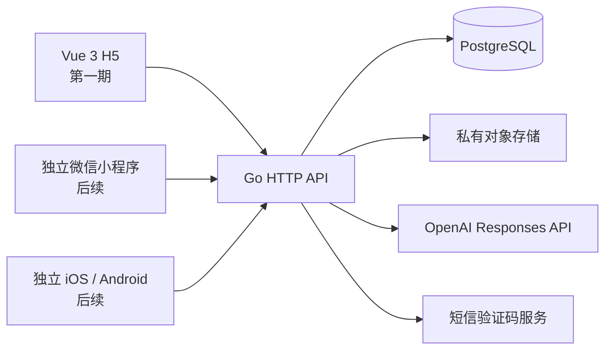
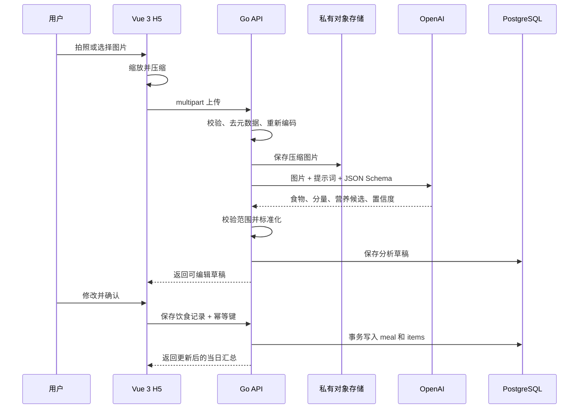

# FormTally 第一期技术架构与选型

> 状态：已确认<br>
> 日期：2026-09-10<br>
> 范围：移动端 H5、饮食图片分析、营养记录、每日目标和历史查询

## 1. 架构结论

FormTally 第一期采用“多客户端应用 + 共享核心 + Go 模块化单体后端 + PostgreSQL + 私有对象存储”的架构。

第一期只实现 `apps/web`：使用 Vue 3 构建并发布移动端 H5。未来的微信小程序和 iOS/Android 客户端各自拥有页面与平台适配代码，通过 `packages/` 复用 API 类型、纯业务规则和设计变量。后端保持为一个可独立部署的 Go 服务，供所有客户端共用，内部按业务模块隔离，不拆微服务。



## 2. 技术选型

| 层级 | 选择 | 说明 |
| --- | --- | --- |
| H5 前端 | Vue 3 + TypeScript | 第一期只实现移动端 H5 页面 |
| 前端构建 | Vite | 使用标准 Web 工具链开发和构建静态 H5 |
| 路由 | Vue Router | 管理 H5 页面导航与登录守卫 |
| UI | 自建业务组件 + CSS 设计变量 | 使用浏览器原生能力，不为未来客户端限制当前 H5 页面 |
| 状态管理 | Pinia | 只管理会话、当日数据和未保存草稿 |
| 前端测试 | Vitest + Playwright | 分别覆盖纯函数和 H5 核心流程 |
| 共享前端代码 | npm workspaces | 共享 API 契约类型、纯业务规则和设计变量，不共享平台页面 |
| 后端语言 | Go 1.27.x | 使用当前受支持的 Go 稳定版本 |
| HTTP 层 | 标准库 `net/http`、`http.ServeMux` | 原生支持按方法匹配和路径参数，不额外引入 Gin、Echo 或 Fiber |
| 日志 | 标准库 `log/slog` | 结构化 JSON 日志，不额外引入日志框架 |
| 数据库 | PostgreSQL 18 | 保存账户、目标、分析草稿、饮食记录和历史数据 |
| 数据库驱动 | `github.com/jackc/pgx/v5` | 直接使用 PostgreSQL 驱动和连接池，不使用 ORM |
| 数据迁移 | `github.com/pressly/goose/v3` + SQL | 迁移脚本可读、可审查、可回滚 |
| 图片存储 | 私有 S3 兼容对象存储 | 数据库只保存对象 key 和元数据 |
| AI SDK | `github.com/openai/openai-go/v3` | 使用官方 Go SDK 调用 Responses API |
| AI 模型 | `gpt-5.6-luna` 作为一期起点 | 适合成本敏感的视觉识别；模型名称通过环境变量配置 |
| 部署 | 单个 Go 容器 + 静态 H5 + 托管 PostgreSQL | 第一期不引入 Kubernetes、服务网格或消息队列 |

依赖版本在项目初始化时由锁文件和 `go.mod` 固定。升级依赖需要通过测试，不使用运行时自动追踪最新版。

## 3. 为什么后端不使用 Web 框架

Go 从 1.22 开始，标准库 `http.ServeMux` 已支持 HTTP 方法和路径通配符，例如：

```go
mux.HandleFunc("GET /v1/days/{date}", handleGetDay)
mux.HandleFunc("PATCH /v1/meals/{id}", handleUpdateMeal)
```

FormTally 一期只有一组 REST API，不需要复杂路由、模板渲染或框架插件系统。鉴权、日志、请求 ID、超时和跨域通过标准 `http.Handler` 中间件组合即可。

只有在标准路由确实无法满足需求时才引入第三方路由器，不为了未来可能出现的需求预装框架。

## 4. 仓库结构

```text
FormTally/
├── apps/
│   └── web/                        # 第一期 Vue 3 H5
│       ├── src/
│       │   ├── pages/              # H5 页面
│       │   ├── components/         # H5 业务组件
│       │   ├── api/                # 浏览器请求与 Cookie 会话
│       │   ├── stores/             # Pinia 状态
│       │   └── styles/             # H5 全局样式
│       └── package.json
├── packages/
│   ├── api-contract/               # 客户端共享的请求、响应和错误类型
│   ├── domain/                     # 与平台无关的表单和营养编辑规则
│   └── design-tokens/              # 颜色、字号和间距变量
├── server/
│   ├── cmd/api/main.go             # 组装依赖并启动 HTTP 服务
│   ├── internal/
│   │   ├── app/                    # 配置、生命周期和依赖组装
│   │   ├── httpapi/                # 路由、中间件和错误响应
│   │   ├── auth/                   # 验证码和会话
│   │   ├── profile/                # 身体资料
│   │   ├── goals/                  # 每日目标计算和目标快照
│   │   ├── meals/                  # 饮食记录和汇总
│   │   ├── analysis/               # 图片分析和 AI 输出校验
│   │   ├── storage/                # 图片对象存储
│   │   └── postgres/               # pgx 查询实现
│   ├── migrations/                 # goose SQL 迁移
│   ├── go.mod
│   └── go.sum
├── docs/
├── package.json                    # npm workspaces 与统一前端命令
├── compose.yaml                    # 本地 PostgreSQL
└── Makefile                        # 统一开发命令
```

`packages/` 中只放当前 H5 已实际使用、且不依赖 DOM、路由或浏览器 API 的代码。未来客户端建立时复用这些包，各自实现页面、导航、登录、相机和其他平台能力。业务代码按功能放置，避免建立全局的 `controller/service/repository` 三层目录。模块只暴露当前调用方需要的方法。

## 5. 后端模块边界

### `auth`

- 请求并校验手机验证码。
- 创建、刷新和撤销登录会话。
- H5 使用 `HttpOnly + Secure + SameSite` Cookie。
- 后续小程序和 App 使用同一类不透明会话令牌，通过 `Authorization` 发送。
- 会话令牌只在数据库保存哈希值，不保存明文。

### `profile`

- 保存性别、出生日期、身高、体重、活动水平和时区。
- 身体资料改变时，不修改已经生成的历史记录。

### `goals`

- 用确定性公式计算每日热量和主要营养素目标。
- 用户可以覆盖自动计算值。
- 每天首次访问时生成目标快照；之后修改资料只影响新日期，历史日期保持原值。
- 目标计算不由 AI 完成。
- Go 后端是目标计算的唯一事实来源，客户端不复制同一套公式。
- 公式名称、版本、输入、关键中间值、取整规则和来源随目标快照保存。
- 公式或政策参数变化时新增版本，不覆盖旧版本的历史计算。

### 公式实现与注释规范

- 所有目标公式集中在 `server/internal/goals`，不得散落在 HTTP handler、数据库查询或前端页面中。
- 一期直接实现当前公式，不为单个实现建立插件系统、工厂或动态规则引擎。
- 每个公式入口的代码注释必须记录公式来源、适用范围、输入单位、取整规则、版本标识和升级约束。
- 活动系数、目标调整比例等产品参数的注释必须说明其产品含义，不能只重复常量名称。
- 注释用于解释“为什么”和“依据是什么”，不逐行复述代码已经表达的运算。
- 对外返回目标时同时返回供界面展示的结构化计算说明；前端只负责渐进式展示。
- 每个公式版本使用固定输入输出样例进行回归测试，并覆盖输入边界、保持目标、取整和历史版本兼容。

### `analysis`

- 校验图片格式、大小和像素尺寸。
- 删除图片元数据并重新编码。
- 调用 OpenAI 并要求返回符合 JSON Schema 的结果。
- 对模型输出做二次范围校验，生成可编辑草稿。
- 保存模型、提示词版本、耗时和标准化结果，不保存隐藏推理内容。

### `meals`

- 将用户确认后的分析草稿保存为正式饮食记录。
- 修改食物重量时重新计算整餐营养值。
- 按用户时区和本地日期汇总热量、蛋白质、碳水和脂肪。
- 编辑或删除记录后实时重新查询汇总，不维护容易失真的缓存总数。

### `storage`

- 本地开发使用文件目录，生产使用私有 S3 兼容存储。
- 图片对象不公开；需要展示时返回短时效签名地址。
- 未保存为饮食记录的分析图片按清理策略删除。

## 6. 主要数据模型

| 表 | 用途 |
| --- | --- |
| `users` | 用户主体和状态 |
| `login_codes` | 验证码哈希、有效期和尝试次数 |
| `sessions` | 不透明会话令牌哈希、设备和有效期 |
| `profiles` | 当前身体资料和时区 |
| `goal_settings` | 当前目标类型和用户覆盖值 |
| `daily_targets` | 某一天实际使用的目标快照，以及公式版本、输入和关键中间值 |
| `meal_analyses` | AI 分析草稿、状态、模型和标准化结果 |
| `meals` | 已确认的一餐、餐别、日期和图片 key |
| `meal_items` | 食物明细、分量和营养值 |

约束原则：

- 所有业务数据都带 `user_id`，查询必须同时限定用户。
- 服务端用 UTC 保存时间点；另存用户时区下的 `local_date` 以支持每日汇总。
- 热量保存为整数千卡；营养素保存到 0.1 克精度。
- `meal_analyses` 不能直接计入每日汇总，只有用户确认后的 `meals` 才能计入。
- 保存饮食记录使用幂等键和数据库事务，重复点击不会生成两条记录。

## 7. API 边界

第一期使用版本化 JSON REST API：

```text
POST   /v1/auth/codes              请求验证码
POST   /v1/auth/sessions           验证并登录
DELETE /v1/auth/session            退出登录

GET    /v1/profile                 获取身体资料
PUT    /v1/profile                 保存身体资料
GET    /v1/goals                   获取目标设置
PUT    /v1/goals                   修改目标设置

POST   /v1/meal-analyses           上传图片并生成 AI 草稿
POST   /v1/meals                   确认并保存一餐
GET    /v1/meals/{id}              查看记录详情
PATCH  /v1/meals/{id}              修改记录
DELETE /v1/meals/{id}              删除记录

GET    /v1/days/{date}             获取某日汇总和餐次
GET    /v1/history?month=2026-09   获取月度记录状态
```

错误统一返回：

```json
{
  "error": {
    "code": "IMAGE_UNSUPPORTED",
    "message": "暂不支持这种图片格式",
    "requestId": "req_..."
  }
}
```

当前接口数量不值得维护两套代码生成器。Go 请求/响应结构体是服务端事实来源，`packages/api-contract` 维护客户端共享的 TypeScript 类型，并通过 API 集成测试验证响应形状。接口扩大或开放给第三方时，再引入 OpenAPI 生成。

## 8. 图片与 AI 数据流



图片要求：

- 客户端上传前将长边限制在 1600 像素以内。
- 第一期接受 JPEG、PNG 和 WebP；统一重新编码为 JPEG。
- 上传体积上限为 10 MB，解码后像素数也必须设上限，防止压缩炸弹。
- 发送给 OpenAI 的是服务端处理后的图片，不暴露永久公开 URL。
- OpenAI API Key 只存在于服务端环境变量。

AI 输出最少包含：

```json
{
  "items": [
    {
      "name": "鸡胸肉",
      "estimatedGrams": 120,
      "energyKcal": 198,
      "proteinGrams": 37.2,
      "carbGrams": 0,
      "fatGrams": 4.3,
      "confidence": "medium",
      "assumption": "按熟制去皮鸡胸肉估算"
    }
  ]
}
```

后端不会只接受一个总热量；总数必须由食物明细相加得到。用户修改重量后，按该食物的单位营养值重新计算。

## 9. 同步处理策略

第一期 AI 分析使用同步 HTTP 请求：客户端展示分析状态，服务端设置明确超时。超时或网络失败时，客户端保留当前图片并允许重试。

暂不引入 Redis、消息队列和独立 worker。只有出现以下证据之一时才升级为异步任务：

- 分析耗时经常超过网关允许时间。
- 同时分析数量导致 API 实例耗尽连接。
- 产品需要在用户离开页面后继续分析并发送通知。

## 10. 安全与隐私

- 所有生产流量使用 HTTPS。
- Cookie 登录请求校验 `Origin`，降低跨站请求伪造风险。
- 验证码、登录和 AI 接口分别限流。
- 服务端根据文件魔数判断类型，不能只相信扩展名和 `Content-Type`。
- 图片和身体数据默认仅本人可访问。
- 日志不记录验证码、会话令牌、图片内容或完整身体资料。
- 用户删除一餐时同步删除失去引用的图片对象。
- 提供删除账户和个人数据的能力。
- AI 结果始终标注为估算，不用于医学诊断。

## 11. 配置和可观测性

服务通过环境变量接收配置：数据库连接、对象存储、短信服务、OpenAI Key、AI 模型和允许的前端来源。启动时校验必要配置，缺失则拒绝启动。

每个请求生成 `request_id`。结构化日志至少记录：

- 路由、状态码和耗时。
- AI 模型、提示词版本、响应状态和耗时。
- 图片处理前后尺寸。
- 数据库错误类别。

日志不能包含用户上传图片、模型完整原始输出或认证秘密。

## 12. 测试策略

### Go 单元测试

使用标准库 `testing`，重点覆盖：

- 每日热量和营养目标计算。
- 公式解释步骤与最终结果一致。
- 公式版本升级后旧目标仍可复现。
- 食物重量改变后的营养重算。
- 日期和时区边界。
- AI JSON 校验与异常范围。
- 会话和验证码的过期逻辑。

### HTTP 测试

使用 `net/http/httptest` 直接调用真实 handler，覆盖鉴权、错误响应、幂等保存和用户数据隔离。

### PostgreSQL 集成测试

针对本地容器中的真实 PostgreSQL 运行迁移和查询测试，不用内存数据库代替 PostgreSQL。

### H5 端到端测试

Playwright 覆盖三条核心路径：

1. 新用户填写资料并进入今日页。
2. 上传固定测试图片、确认 AI 草稿并保存。
3. 从历史记录修改或删除一餐，检查汇总同步变化。

AI 端到端测试使用一个小型、人工标注的真实餐食图片集，分别记录结构化输出成功率、分量误差、热量误差、耗时和单次成本。模型选择以评测结果为准，而不是只比较模型宣传参数。

## 13. 部署设计

```text
静态托管 / CDN
└── Vue 3 H5

单台 Linux 主机或容器平台
└── formtally-api

托管服务
├── PostgreSQL
└── 私有对象存储
```

Go API 构建为单个 Linux 二进制并放入精简容器。数据库迁移在发布阶段显式执行，不在每个 API 实例启动时自动运行。

云厂商不写入业务代码：对象存储只依赖 S3 兼容接口，短信服务放在独立边界。面向中国大陆正式上线时，再选择满足备案、数据存储和短信签名要求的国内部署方案；代码架构不因此改变。

## 14. 训练模块的扩展方式

后续训练功能增加独立模块和数据表：

```text
workouts
├── workout_sessions
├── workout_exercises
└── exercise_sets
```

饮食记录和训练记录不放在同一张多态表中。当天页面通过服务层分别查询摄入和训练，再组合为时间线。

训练消耗默认单独展示，不直接增加“还可摄入”的热量，避免与活动水平目标重复计算。只有用户明确启用动态目标模式后，才用当天训练记录调整目标。

## 15. 一期明确不采用

- Gin、Echo、Fiber、NestJS 或 Spring Boot。
- ORM 和自动同步数据库结构。
- 微服务、GraphQL、Redis、消息队列和 Kubernetes。
- 自建 AI 模型、向量数据库和 RAG。
- 为尚未实现的训练功能建立通用事件平台。
- 仅由 AI 返回且不可解释、不可修改的总热量。

## 16. 官方依据

- [Go 1.27 发布记录](https://go.dev/doc/devel/release)
- [Go 标准库路由增强](https://go.dev/blog/routing-enhancements)
- [`net/http` 文档](https://pkg.go.dev/net/http)
- [`pgx` PostgreSQL 驱动](https://github.com/jackc/pgx)
- [`goose` 数据迁移工具](https://github.com/pressly/goose)
- [PostgreSQL 当前文档](https://www.postgresql.org/docs/)
- [Vue 3 官方文档](https://vuejs.org/guide/introduction.html)
- [Vite 官方文档](https://vite.dev/guide/)
- [OpenAI 官方 Go SDK](https://github.com/openai/openai-go)
- [OpenAI Responses API](https://developers.openai.com/api/reference/cli/resources/responses/methods/create)
- [OpenAI 当前模型说明](https://developers.openai.com/api/docs/models)
