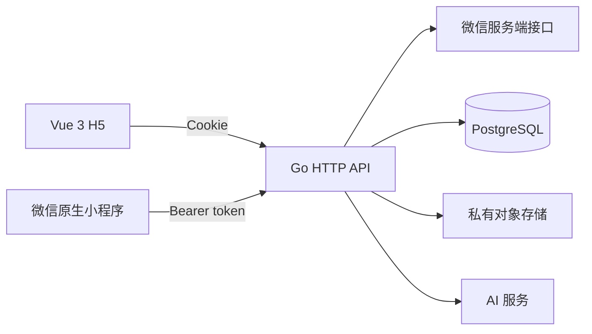
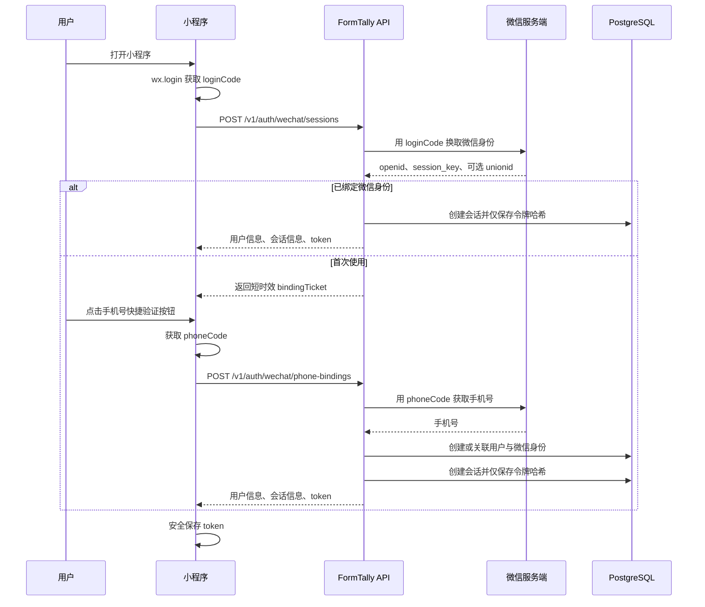

# FormTally 微信小程序技术设计

> 状态：已确认
> 日期：2026-09-14
> 范围：微信原生小程序客户端、微信身份登录、手机号绑定及现有 API 的多客户端认证适配

## 1. 目标与边界

在现有 H5 和 Go API 保持可用的前提下，新增一个微信原生小程序客户端，完整覆盖以下用户闭环：

1. 用户通过微信身份和微信手机号快捷验证登录。
2. 新用户完成身体资料和每日目标设置。
3. 用户拍摄或选择饮食图片，获取 AI 营养分析草稿。
4. 用户修改并确认分析结果，保存饮食记录。
5. 用户查看、编辑和删除当天或历史饮食记录。
6. 用户管理身体资料、营养目标和账户。

小程序复用现有 Go API、PostgreSQL 数据、API 契约和纯业务规则。H5 继续使用 Cookie 会话，小程序使用 Bearer 会话令牌，两端访问同一用户数据。

本期不增加支付、订阅消息、运动记录、离线同步、多小程序平台兼容或独立后端服务。

## 2. 总体架构



新增 `apps/miniprogram`，采用原生 TypeScript、WXML、WXSS 和微信组件。页面和平台适配代码独立维护，通过 npm workspace 复用：

- `@formtally/api-contract`：请求、响应和错误类型。
- `@formtally/domain`：不依赖 DOM 或 Vue 的表单校验与营养编辑规则。
- `@formtally/design-tokens`：将设计值增加为可供 TypeScript 和 WXSS 构建消费的来源。

不在两个客户端间共享页面组件、路由、浏览器存储、图片对象或请求实现。

## 3. 小程序目录

```text
apps/miniprogram/
├── app.ts
├── app.json
├── app.wxss
├── project.config.json
├── sitemap.json
├── components/              # 小程序业务组件
├── pages/
│   ├── login/               # 微信登录与手机号绑定
│   ├── onboarding-profile/
│   ├── onboarding-goal/
│   ├── onboarding-result/
│   ├── today/
│   ├── meal-capture/
│   ├── meal-analyzing/
│   ├── meal-confirm/
│   ├── meal-manual/
│   ├── meal-detail/
│   ├── meal-edit/
│   ├── history/
│   ├── me/
│   ├── profile/
│   ├── goals/
│   └── delete-account/
├── services/                # API 请求与上传
├── stores/                  # 会话、今日、历史、引导和餐食草稿
├── platform/                # 微信登录、媒体选择、图片处理和存储
└── utils/
```

底部使用微信原生 Tab Bar，包含“今日、记录、历史、我的”。“记录”进入饮食拍摄页。首期不实现自定义 Tab Bar。

## 4. 登录和账户绑定

### 4.1 登录流程



`loginCode` 和 `phoneCode` 均为一次性凭证，客户端不得缓存后重复使用。`bindingTicket` 是服务端生成的短时效、一次性、不透明凭证，只用于关联刚刚验证的微信身份；数据库仅保存其哈希。AppSecret 仅存在于服务端环境变量。

### 4.2 账户归并规则

服务端以 `(provider, provider_subject)` 唯一识别微信身份，其中 `provider_subject` 保存当前小程序下的 `openid`。

收到已验证手机号后按以下顺序处理：

1. 已存在该微信身份：登录其关联用户，并在手机号发生变化时按产品规则要求重新确认，不自动迁移账户。
2. 微信身份不存在、手机号已属于现有用户：将微信身份绑定到该用户。
3. 微信身份和手机号均不存在：创建用户并绑定微信身份。
4. 微信身份与手机号分别指向不同用户：拒绝自动归并，返回明确冲突错误，由后续受控账户恢复流程处理。

`unionid` 仅在微信返回时保存，用于未来同一开放平台下的身份识别，不作为本期登录成功的必要条件。

### 4.3 API

新增：

```text
POST /v1/auth/wechat/sessions
POST /v1/auth/wechat/phone-bindings
```

微信会话请求：

```json
{
  "loginCode": "微信登录临时凭证"
}
```

已绑定身份时直接返回现有 session、user、consents 结构和顶层 `token`。首次使用时返回：

```json
{
  "bindingRequired": true,
  "bindingTicket": "服务端一次性绑定凭证",
  "expiresInSeconds": 300
}
```

手机号绑定请求：

```json
{
  "bindingTicket": "服务端一次性绑定凭证",
  "phoneCode": "手机号快捷验证临时凭证",
  "agreements": {
    "termsVersion": "2026-09-10",
    "privacyVersion": "2026-09-10"
  }
}
```

绑定成功响应沿用现有 session、user、consents 结构，并增加顶层 `token`。令牌是现有不透明会话令牌，不使用 JWT。

现有接口继续保留：

```text
GET    /v1/auth/session
DELETE /v1/auth/session
```

二者同时支持 Cookie 和 `Authorization: Bearer <token>`。

### 4.4 数据模型

新增迁移：

```text
user_identities
- id
- user_id               FK users(id)
- provider              固定枚举值 wechat_miniprogram
- provider_subject      openid
- union_id              nullable
- created_at
- updated_at
```

约束：

- 唯一索引 `(provider, provider_subject)`。
- `provider_subject`、`union_id` 不写入普通访问日志。
- 删除账户时与用户其他个人数据一并删除。

现有 `sessions` 表增加 `client_type`，值为 `web` 或 `wechat_miniprogram`，用于审计和撤销，不用于授权判断。

## 5. 请求认证与安全边界

认证器按以下顺序处理：

1. 存在 `Authorization` 时，只接受格式正确的 Bearer token。
2. 不存在 `Authorization` 时，读取 H5 Cookie。
3. 同一请求同时携带两种凭证时拒绝请求，避免身份歧义。

CSRF 来源校验只用于 Cookie 认证的浏览器写请求。Bearer 请求不依赖 `Origin`，但必须通过会话认证。微信登录和手机号绑定接口不使用客户端可伪造的来源标记放行，而是校验微信一次性凭证及服务端绑定凭证，并执行独立限流。

微信服务端请求必须设置超时，不记录 AppSecret、临时 code、session_key、手机号或完整微信响应。对微信侧超时、无效 code、频率限制和响应格式异常分别映射为稳定的 API 错误码。

新增配置：

```text
WECHAT_APP_ID
WECHAT_APP_SECRET
WECHAT_API_BASE_URL=https://api.weixin.qq.com
WECHAT_API_TIMEOUT=5s
```

`WECHAT_API_BASE_URL` 可配置仅用于本地自动化测试连接伪微信服务器；生产环境必须使用 HTTPS 并限制为微信官方主机。

## 6. 小程序请求层

`services/http.ts` 封装 `wx.request`：

- 以环境配置拼接 HTTPS API 基地址。
- 从本地存储读取 Bearer token。
- 添加 `Accept-Language: zh-CN` 和请求 ID。
- 解析统一 API 错误结构。
- 收到 401 时清除本地会话并进入登录页。
- 不在业务页面重复处理协议细节。

`services/upload.ts` 单独封装 `wx.uploadFile`，负责 multipart 字段、幂等键、进度和取消。图片上传仍调用现有 `POST /v1/meal-analyses`，其余业务 API 保持不变。

小程序将 token 保存到微信本地存储。客户端存储不可视为秘密保险箱，因此服务端继续采用短生命周期、可撤销、不透明随机令牌，并只在数据库保存哈希。

## 7. 图片处理

选择图片统一通过 `wx.chooseMedia`，仅允许相机或相册中的单张图片。平台适配层负责：

1. 获取临时文件路径、大小和图片尺寸。
2. 拒绝超过服务端上限或无法解码的文件。
3. 将长边缩放到不超过 1600 像素，并压缩为 JPEG。
4. 保留处理后的临时路径，分析失败时允许直接重试。
5. 使用 `wx.uploadFile` 上传，成功或用户放弃后清理草稿引用。

服务端继续执行文件魔数校验、像素上限校验、去元数据和重新编码；客户端处理只用于减少上传体积，不能替代服务端安全校验。

## 8. 页面状态与数据流

小程序 store 使用普通 TypeScript 对象和显式订阅，不新增状态管理依赖。状态按业务拆分：

- `session`：token、用户、恢复状态。
- `onboarding`：资料和目标设置草稿。
- `today`：所选日期及当日汇总。
- `history`：月份状态和当前选择日期。
- `mealDraft`：图片路径、分析状态、识别项、餐别和幂等键。

页面 `onLoad` 解析参数，`onShow` 刷新需要回显的数据，`onUnload` 释放只属于页面的临时资源。全局启动只恢复会话，不预取全部业务数据。

幂等键在用户首次发起分析或保存时生成，在成功、明确失败或用户放弃前保持不变，避免网络重试生成重复草稿或饮食记录。

## 9. 授权、隐私与错误恢复

首次使用相关能力时展示用途明确的说明，并遵守微信平台要求配置用户隐私保护指引。至少覆盖：

- 手机号快捷验证。
- 相机和相册选择。
- 食物图片上传及 AI 处理同意。
- 身体资料、饮食记录和账户删除。

用户拒绝手机号授权时留在登录页并允许重新发起。用户拒绝相机能力时仍可从相册选择。网络失败、AI 超时或上传失败时保留本次图片和表单草稿，提供重试或手动录入；会话过期时登录成功后返回原业务入口，但不在本期持久化跨进程图片草稿。

## 10. 微信平台与环境配置

微信公众平台需要配置：

- 小程序 AppID、项目成员和体验成员。
- 生产 API 的 `request` 合法域名。
- 图片接口的 `uploadFile` 合法域名。
- 用户隐私保护指引及实际使用的隐私接口。
- 服务类目、名称、图标、简介和审核材料。

开发、体验和生产环境分别提供非秘密的 API 基地址配置。AppSecret 只配置在对应服务端环境，不写入小程序代码、`project.config.json`、构建产物或仓库。

## 11. 测试与验收

### 11.1 自动化测试

服务端：

- 微信响应解析、超时和错误映射。
- 微信身份首次创建、重复登录和现有手机号账户绑定。
- 身份冲突不会静默归并。
- Bearer token 创建、认证、过期和撤销。
- Cookie 与 Bearer 双认证回归。
- Cookie 写请求继续校验 Origin，Bearer 写请求按会话认证。
- 删除账户同时删除微信身份。

小程序：

- 请求头、错误解析、401 会话清理。
- 上传字段、幂等键和失败重试。
- 登录、媒体选择和本地存储平台适配层。
- 可复用 domain 规则在小程序构建目标下通过测试。
- 微信开发者工具能够完成 TypeScript 编译和小程序构建。

### 11.2 真机验收

至少在 iOS 和 Android 微信各执行一次：

```text
微信登录
→ 手机号授权
→ 完成资料与目标
→ 拍照并上传
→ AI 分析
→ 修改并保存
→ 今日汇总更新
→ 历史查看和编辑
→ 退出后重新登录
→ 删除账户
```

同时验证弱网重试、拒绝相机权限、拒绝手机号授权、会话过期、上传超限和 AI 超时。

## 12. 实施阶段

1. **认证基础**：微信服务端客户端、身份表、Bearer 会话、登录 API 和安全测试。
2. **小程序骨架**：工程配置、请求层、会话恢复、页面路由和原生 Tab Bar。
3. **首次使用流程**：登录、手机号绑定、资料、目标和结果页。
4. **饮食核心闭环**：今日、图片选择与处理、分析、确认、手动录入和保存。
5. **历史与账户**：历史日历、详情编辑、资料、目标和删除账户。
6. **发布验收**：微信后台配置、隐私声明、开发者工具构建、体验版和真机旅程。

每一阶段都必须保持 H5 流程和现有 API 契约通过回归测试。真实微信登录和手机号获取只有在体验版或真机环境完成后，才能视为已验证。

## 13. 完成标准

- 小程序使用微信身份及微信手机号快捷验证建立或关联 FormTally 账户。
- H5 和小程序登录同一手机号后访问同一份资料、目标和饮食数据。
- 小程序完成当前 H5 的核心饮食记录、历史和账户管理功能。
- H5 Cookie 安全边界不因 Bearer 支持而减弱。
- AppSecret、会话令牌和微信敏感响应不进入日志或客户端构建产物。
- 自动化测试、微信开发者工具构建以及 iOS/Android 真机核心旅程均通过。
