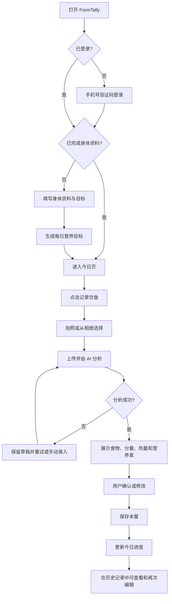

# FormTally 第一期使用流程

> 文档状态：产品流程草案
> 目标终端：移动端 H5
> 核心闭环：拍照记录饮食 → AI 估算 → 用户确认 → 更新当天营养进度

## 1. 一期体验目标

用户第一次使用时，完成身体资料和目标设置；之后每次记录一餐，只需拍照、确认、保存三个主要动作。AI 负责减少输入工作，用户始终拥有最终确认权。

一期只处理饮食摄入、身体资料、每日目标和历史记录。运动记录作为后续扩展点保留，不在当前界面放置不可用入口。

## 2. 页面地图

| 编号 | 页面 | 主要用途 |
| --- | --- | --- |
| P01 | 欢迎与登录 | 手机号验证码登录或注册 |
| P02 | 初始资料 | 填写身体数据、活动水平和目标 |
| P03 | 今日 | 查看热量与主要营养素进度、开始记录饮食 |
| P04 | 拍照或上传 | 调用相机或选择相册图片 |
| P05 | AI 分析中 | 显示图片预览和分析进度 |
| P06 | 确认识别结果 | 检查、修改食物名称、重量和营养估算 |
| P07 | 历史 | 按日期查看饮食记录和营养汇总 |
| P08 | 记录详情 | 查看、修改或删除已经保存的一餐 |
| P09 | 我的 | 修改身体资料、目标和偏好 |

底部导航采用 `今日 / 记录 / 历史 / 我的`。一期点击“记录”直接进入饮食拍照；未来加入训练功能时，再改为“记录饮食 / 记录训练”的动作选择层。

## 3. 主流程



## 4. 首次使用模拟

### 4.1 登录

1. 用户打开 H5 首页，看到产品说明和“开始使用”。
2. 输入手机号并完成验证码登录。
3. 登录成功后，系统检查该用户是否已有身体资料。
4. 新用户进入资料设置；老用户直接进入今日页。

### 4.2 设置个人目标

用户依次填写：

- 性别、出生日期
- 身高、当前体重
- 日常活动水平
- 当前目标：减脂、保持或增肌
- 期望的变化速度

系统生成每日热量、蛋白质、碳水和脂肪目标。结果页需要说明这些数值是估算起点，并允许用户手动调整。

### 4.3 进入今日页

今日页优先回答三个问题：

1. 今天已经摄入多少？
2. 距离目标还差多少，哪些指标已经超出？
3. 如何快速记录下一餐？

页面顶部显示日期和每日热量进度，下面显示蛋白质、碳水、脂肪三项进度，再下面按早餐、午餐、晚餐、加餐显示已保存记录。

## 5. 记录一餐模拟

以下数字仅用于模拟界面，不构成营养建议。

场景：用户小林午餐吃了一份鸡胸肉盖饭。

1. 小林在今日页点击“记录饮食”。
2. 系统询问拍照或从相册选择；小林拍摄餐盘。
3. 页面立即显示图片预览，小林可以重拍或确认上传。
4. 上传后进入分析状态，提示“正在识别食物和估算分量”。
5. AI 返回候选结果：
   - 米饭，约 180 克
   - 鸡胸肉，约 150 克
   - 清炒蔬菜，约 120 克
   - 烹调用油，约 10 克，低置信度
6. 系统汇总为约 610 千卡、蛋白质 48 克、碳水 63 克、脂肪 18 克。
7. 小林发现鸡胸肉实际约 120 克，将重量改为 120 克。
8. 系统立即重新计算整餐结果，小林选择“午餐”并保存。
9. 页面回到今日页，热量和三项营养素进度立即更新；午餐列表出现该图片和摘要。

AI 不能只返回一个总热量。必须展示可编辑的食物明细和估算分量，让用户知道数值从哪里来。

## 6. 查看和修正历史记录

1. 用户进入“历史”，默认打开今天。
2. 顶部日历标识有记录的日期，并显示当天热量状态：不足、接近目标或超出。
3. 用户点击某天，查看当天营养汇总和各餐记录。
4. 点击一餐进入详情，可修改餐别、食物、分量或营养值。
5. 修改保存后，该日期的所有汇总数据重新计算。
6. 删除一餐前进行二次确认；删除成功后同步更新当天进度。

## 7. 异常与恢复流程

| 场景 | 用户看到的处理方式 |
| --- | --- |
| 图片模糊或无法识别 | 保留图片，提示重拍或进入手动录入 |
| 只识别出部分食物 | 标记低置信度项目，要求用户确认或补充 |
| 网络断开 | 保留本地草稿，恢复网络后允许重试 |
| AI 超时 | 显示重试按钮，不要求用户重新选图 |
| 图片过大或格式不支持 | 上传前压缩；仍不支持时给出明确格式提示 |
| 保存按钮被重复点击 | 只生成一条记录，并显示保存中的状态 |
| 营养目标缺失 | 引导用户先补全资料，也允许手动设置目标 |

## 8. 数据与隐私提示

- 首次分析前明确告知：食物图片会发送给 AI 服务处理。
- 历史记录只保存压缩后的图片，用户可以删除图片或整条记录。
- AI 结果统一标注为估算值，不能表述为医学诊断或精确检测结果。
- 身体资料、图片和饮食记录默认仅本人可见。
- 用户可以修改和删除自己的全部记录。

## 9. 为训练生态预留的流程

后续加入训练记录时，复用统一的“记录”入口和时间线：

```text
记录 → 选择饮食或训练
训练 → 选择动作 → 录入组数、次数、重量、时长和强度
     → 估算运动消耗 → 用户确认 → 写入当天时间线
```

需要避免热量重复计算：一期的每日目标由身体资料和活动水平估算；后续记录具体训练时，默认单独展示运动消耗，不直接增加“还能吃”的额度。只有用户切换到动态目标模式后，才根据实际训练调整当天目标。

## 10. 一期验收标准

- 新用户能在一次连续流程中完成登录、资料设置并进入今日页。
- 用户能使用手机相机或相册提交一张食物图片。
- AI 结果包含可编辑的食物明细、分量、热量和主要营养素。
- 用户确认后，记录只保存一次，并立即更新当天汇总。
- 用户能从历史记录重新编辑或删除一餐，汇总结果同步变化。
- 上传、分析或网络失败时，用户无需从头开始。
- 所有 AI 数值均明确标记为估算，不作为医疗建议。
